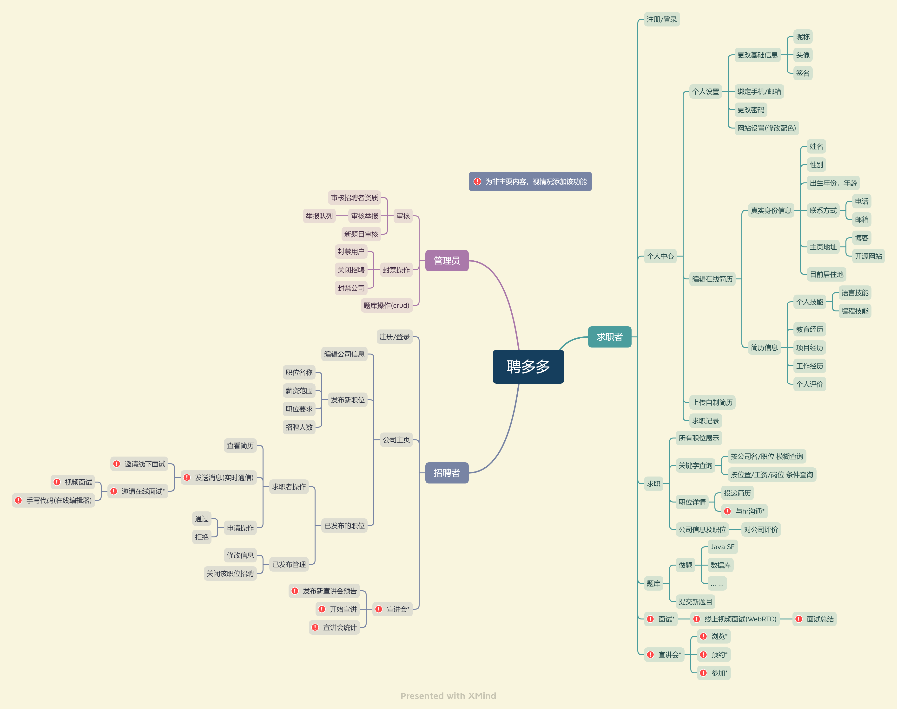

# 聘多多(SSM小组项目)

## 概述

本项目以Java程序员招聘为主题的网站，设计上借鉴[牛客网](https://www.nowcoder.com/)，[BOSS直聘](https://www.zhipin.com/?ka=header-home-logo)等现有招聘网站

项目地址：[GitHub](https://github.com/omoidesu/duoduopin)

## 需求分析

需求以用户身份分为三个部分：网站管理员，求职者，招聘者

### 求职者

求职者分为5大板块：`个人中心`、`求职`、`题库`、`面试`、`宣讲（求职端）`。其中面试及宣讲视情况决定是否加入

---

个人中心板块包含`个人设置`、`制作在线简历`、`上传自制简历`、`offer管理`四个模块

> 个人设置包含更换头像/昵称等基本信息、绑定/解绑联系方式、修改密码、网站设置四部分组成

> 编辑在线简历与现有招聘网站的功能相同，包含个人基本信息，相关经历和自我评价

> 上传自制简历支持doc、docx、pdf、md、html格式，其中html格式处理<script>标签以防恶意攻击。自制简历会在求职者投递职位申请后在招聘端以副本形式提供下载

> 求职记录以列表或表格形式记录职位申请记录及进度，面试邀请的记录，已收到的offer，并以日历的形式展示未来的预定

---

求职板块即为招聘信息的展示页，包含职位展示，搜索，职位详情和公司信息四部分

---

题库部分借鉴了[牛客网](https://www.nowcoder.com/exam/intelligent)
的题库部分，将面试题以问题的形式列出，点击进入后可编写解答。回答后将显示标准答案。另外有一个由用户上传新题目的入口。将编辑好的题目提交至管理员的审核队列

---

面试板块使用WebRTC技术使求职者和招聘者一对一在线面试，同时也可以文字交流

求职者在面试后可对本次面试做总结，以在线笔记形式总结本次面试的缺点及不足

---

宣讲会为企业宣传的模块，以直播的形式一对多进行宣讲

求职端该模块分为浏览各公司宣讲会信息，预约宣讲，参加宣讲三部分。在参加宣讲的过程中可以投递自己的简历

### 招聘者

招聘者与求职者均为普通用户，不同的是招聘者拥有发布招聘信息的权限，并可以在点击导航栏的头像的弹出菜单中更换身份。用户申请为招聘者需要填写公司信息并由管理员审核

招聘者主要包含两大模块：`公司主页`，`品牌宣讲`

---

公司主页由编辑公司信息、发布新职位、管理已发布的职位三部分组成

---

> 编辑公司信息包含公司简介、地理位置、职员人数、环境预览照片等功能

> 发布新职位包括职位信息、薪资范围、职位要求、招聘人数

> 管理已发布职位包含对投递简历的筛选和对已发布职位的管理
>
> 1. 简历筛选流程为查看简历 -> 与求职者沟通 -> 操作申请。其中沟通有普通的文字沟通，邀请在线电话/视频面试，也可以双方共同决定线下面试
> 2. 管理已发布的职位即修改招聘信息和关闭该招聘两功能

---

宣讲会在招聘端分为发布新的宣讲预告，宣讲过程中和宣讲结束后的统计。其中统计记录本次宣讲会预定人数，实际参加人数，收到的职位申请总数，消息总数

### 管理员

管理员拥有审核、封禁、管理题库三个行为

> 审核分为审核招聘者的资质和审核不良信息的举报。举报由用户发现不良信息后举报至管理员的审核队列

> 封禁即为审核后的操作，可以封禁用户，关闭进行中的招聘，封禁公司拒绝新招聘

> 管理题库即对题库的增删查改等基本操作

## 前端设计

...

## 后端模块

登录模块、求职模块、设定模块、实时沟通模块、题库模块

## 数据库

数据库目前由12张表组成

### 1. 用户表

| 字段         | 类型 / 约束                                                          | 备注                              |
|------------|------------------------------------------------------------------|---------------------------------|
| id         | integer / primary key / check id between 100000000 and 999999999 | 用户id                            |
| username   | text unique                                                      | 用户名                             |
| password   | text                                                             | 密码                              |
| permission | int / check permission in (1, 10, 99)                            | 权限，-1为已封禁，1为基础用户，10为高级用户，99为管理员 |

### 2. 用户信息表

| 字段       | 类型  / 约束                               | 备注            |
|----------|----------------------------------------|---------------|
| id       | integer / primary key / auto_increment | 主键            |
| user_id  | int                                    | 用户id          |
| nickname | text                                   | 昵称            |
| bio      | text                                   | 个人签名          |
| email    | text                                   | 邮箱地址          |
| gender   | int / check gender in (0, 1)           | 性别，1代表男，0代表女  |
| avatar   | text                                   | 头像 保存为头像图片文件名 |
| phone    | text                                   | 手机号           |
| color    | text                                   | 个性化网站颜色       |

### 3. 简历信息表

| 字段              | 类型 / 约束                                | 备注                        |
|-----------------|----------------------------------------|---------------------------|
| id              | integer / primary key / auto_increment | 简历id                      |
| user_id         | int                                    | 用户id                      |
| real_name       | text                                   | 姓名                        |
| birthday        | text                                   | 出生年月                      |
| wechat          | text                                   | 微信号                       |
| weibo           | text                                   | 微博                        |
| email_address_2 | text                                   | 备用邮箱                      |
| homepage        | text                                   | 个人网站                      |
| address         | text                                   | 现住址                       |
| other           | text                                   | 掌握技能，各种经历等，以用户id.json格式保存 |
| appendix        | text                                   | 简历文件名                     |

### 4. 公司表

| 字段                | 类型 / 约束                                | 备注              |
|-------------------|----------------------------------------|-----------------|
| id                | integer / primary key / auto_increment | 公司id            |
| company_name      | text                                   | 公司名             |
| company_address   | text                                   | 公司地址            |
| company_employees | int                                    | 员工数量            |
| about             | text                                   | 公司介绍            |
| ban               | int / default 0 / check ban in (0, 1)  | 已封禁 0为未封禁，1为已封禁 |

### 5. 雇员表

| 字段         | 类型 / 约束               | 备注   |
|------------|-----------------------|------|
| id         | integer / primary key | 主键   |
| user_id    | int                   | 用户id |
| company_id | int                   | 公司id |

### 6. 职位表

| 字段             | 类型 / 约束                                   | 备注                   |
|----------------|-------------------------------------------|----------------------|
| id             | integer / primary key                     | 职位id                 |
| job_name       | text                                      | 职位名称                 |
| job_poster_id  | int                                       | 招聘者id                |
| job_count_min  | int                                       | 招聘人数(最小值)            |
| job_count_max  | int / check job_count_max > job_count_min | 招聘人数(最大值)            |
| job_salary_min | int                                       | 薪资范围(最小值)            |
| job_salary_max | int                                       | 薪资范围(最大值)            |
| job_detail     | text                                      | 职位要求                 |
| job_post_date  | text                                      | 发布日期                 |
| closed         | int / check closed in (0, 1)              | 招聘是否关闭，0表示未关闭，1表示已关闭 |

### 7. 投递表

| 字段        | 类型 / 约束               | 备注                                                                           |
|-----------|-----------------------|------------------------------------------------------------------------------|
| id        | integer / primary key | 主键                                                                           |
| job_id    | int                   | 职位id                                                                         |
| poster_id | int                   | 求职者id                                                                        |
| progress  | int                   | 投递进度  -1: 已拒绝  1: 已投递  2：已查看  3: 已沟通  4: 已面试  9: 已通过 |

### 8. 题库表

| 字段              | 类型 / 约束               | 备注    |
|-----------------|-----------------------|-------|
| id              | integer / primary key | 题目id  |
| question_name   | text                  | 题目名   |
| question_answer | text                  | 题目答案  |
| question_belong | int                   | 题目分类  |
| question_poster | int                   | 出题人id |
| question_date   | text                  | 出题日期  |

### 9. 回答表

| 字段             | 类型 / 约束               | 备注     |
|----------------|-----------------------|--------|
| id             | integer / primary key | 回答id   |
| question_id    | int                   | 题目id   |
| answer         | text                  | 回答内容   |
| answer_user_id | int                   | 回答用户id |
| answer_date    | text                  | 回答日期   |

### 10. 公司评价

| 字段           | 类型 / 约束                                     | 备注     |
|--------------|---------------------------------------------|--------|
| id           | integer / primary key                       | 评价id   |
| to_company   | int                                         | 公司id   |
| user_id      | int                                         | 留言用户id |
| comment_rate | int / check comment_rate in (1, 2, 3, 4, 5) | 等级     |
| comment      | text                                        | 留言内容   |

### 11. 举报表

| 字段              | 类型 / 约束                          | 备注                                        |
|-----------------|----------------------------------|-------------------------------------------|
| id              | integer / primary key            | 举报id                                      |
| report_type     | int / check in report_type in () | 举报类型                                      |
| target_id       | int                              | 举报目标id                                    |
| reporter_id     | int                              | 举报者id                                     |
| report_reason   | text                             | 留言                                        |
| report_progress | int                              | 举报进度  1: 新举报  2: 已处理  -1: 已关闭 |
| report_reply    | text                             | 举报回复                                      |
| operator        | int                              | 处理者id                                     |

### 12. 日程表

| 字段          | 类型 / 约束               | 备注   |
|-------------|-----------------------|------|
| id          | integer / primary key | 日程id |
| for         | int                   | 所属用户 |
| detail      | text                  | 日程信息 |
| create_date | text                  | 创建日期 |

### 13 权限注册申请表

